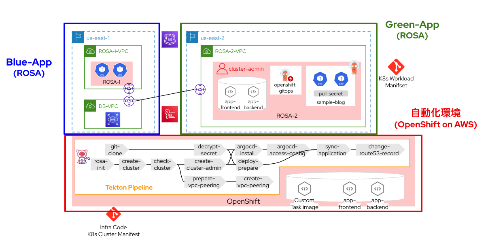

# OpenShift Blue/Geen デプロイメント自動化デモ

## はじめに
Red Hat OpenShift on AWSを使ったクラスターのBlue/Green デプロイメントの自動化を行います。
本リポジトリはForkした上でご利用ください。



## 本デモの詳細
こちらのデモは[OpenShift.Run 2023](https://openshift.connpass.com/event/234302/)で発表したものです。
デモの詳細な説明は[こちらのスライド]()を参照ください。


## 前提条件
* 作業端末
  * terraform cli
  * awscli
* Pipeline実行用クラスター
  * OpenShift Container Platform : 4.12.0
  * Cluster-admin Roleを持つユーザー
  * インターネットへのアウトバウンドアクセスが可能
* Red Hat OpenShift Cluster ManagerのAPI Tokenを取得可能なアカウント
* AWSアカウント
  * AdministoratorAccessのロールを持つIAMユーザー
  * ROSAクラスター作成に必要な上限緩和済み
  * AWS KMSでカスタマー管理型のキー(対称)を作成済み（ここではエイリアス"secret-key"を想定）
  * Route53 でアプリ用のレコードを1つ作成済み


## 手順
### Pipelineの設定 @Pipeline実行用クラスター
OpenShift Pipeline Operatorのインストール
```
cd openshift-upgrade-automation/ci-manifest/init
oc apply -f operator/openshift-pipelines-operator.yaml
```

Operatorのインストールが完了するまで待つ
```
oc get csv -n openshift-operators -l operators.coreos.com/openshift-pipelines-operator-rh.openshift-operators -w
--> PHASEが"Succeed"になるまで待つ
```

Pipeline実行用のProject作成
```
oc apply -f project/project.yaml
oc project rosa-create-ci
```

Secretの作成
以下の3つのSecretを準備する
* aws-creds.yaml : Pipelineでrosaコマンドやawsコマンドの実行に必要な権限を付与する
* git-auth.yaml : Pipelineでアプリ用マニフェストやクラスター設定ファイルのリポジトリをCloneするためのアカウント情報
* rosa-token.yaml : Red Hat OpenShift Cluster Managerで取得したAPI Token* 
環境変数を設定
```
export AWS_ACCESS_KEY_ID="<AWSのアクセスキー>"
export AWS_SECRET_ACCESS_KEY="<AWSのシークレットキー>"
export AWS_REGION="us-east-1"
export GIT_USER="<Gitのユーザー名>"
export GIT_PASS="<Gitのパスワード>"
export ROSA_TOKEN="OCMのAPI Token"
```
* OCMのAPI Tokenは[こちら](https://console.redhat.com/openshift/token)から入手

Secretをデプロイ
```
envsubst < secrets/aws-credentials.yaml | oc apply -f -
envsubst < secrets/terraform-secret.yaml | oc apply -f -
envsubst < secrets/git-auth.yaml | oc apply -f -
envsubst < secrets/rosa-token.yaml | oc apply -f -
```

PVCの作成
```
oc apply -f pvc
```

Service AccountとRBACの作成
```
oc apply -f serviceaccount
```

Pipeline用のDockerイメージ作成
* rosaコマンドやawscliを実行するためのイメージを作成する
```
oc new-build --name=aws-rosa-cli --strategy=docker --binary
oc start-build aws-rosa-cli --from-dir=./docker-aws-rosa
```

### イメージの準備 @Pipeline実行用クラスター

Projectの作成
```
cd ../../sample-blog-app
oc apply -f project.yaml
```

イメージビルド
```
oc new-build --name=nginx --strategy=docker --binary -n sample-blog
oc start-build nginx --from-dir=./docker/nginx/ -n sample-blog
oc new-build --name=django --strategy=docker --binary -n sample-blog
oc start-build django --from-dir=./docker/django/ -n sample-blog
```

内部レジストリを外部に公開する
```
oc patch configs.imageregistry.operator.openshift.io/cluster --patch '{"spec":{"defaultRoute":true}}' --type=merge
export DEFAULT_ROUTE_HOST=$(oc get route default-route -n openshift-image-registry --template='{{ .spec.host }}')
```


### イメージPull Secretの準備 @Pipeline実行用クラスター

イメージのPull Secretを取得
```
cd ../cluster-manifest
export SECRET=$(oc -n sample-blog get secret | grep default-docker | awk {'print $1'})
oc -n sample-blog get secret $SECRET -o jsonpath="{.data['\.dockercfg']}" | base64 --decode | jq -r '.["image-registry.openshift-image-registry.svc:5000"].password' > ./k8s/app/secrets/pull-secret.txt
```

pull-secret.txtをAWS KMSで暗号化
```
aws kms encrypt \
    --key-id alias/secret-key \
    --plaintext fileb://k8s/app/secrets/pull-secret.txt \
    --output text \
    --region ap-northeast-1 \
    --query CiphertextBlob | base64 --decode > encrypted-pull-secret.txt
```

### GitOpsの設定
GitOpsのApplicationに設定するGitリポジトリのURLを設定
```
export GIT_URL="<ForkしたGitリポジトリのURL>"
envsubst < k8s/openshift-gitops/argocd-app-project.tpl > k8s/openshift-gitops/argocd-app-project.yaml
envsubst < k8s/openshift-gitops/argocd-application.tpl > k8s/openshift-gitops/argocd-application.yaml
```

### RDS(MySQL)のデプロイ

TerraformでRDSを作成
```
cd ../sample-blog-manifest/terraform
envsubst < credentials.tpl > credentials.tf
terraform init
terraform apply --auto-approve
```

デプロイしたRDSのホスト名を取得してconfigmapに設定
```
cd ../
export RDS_HOST="<RDSのホスト名>"
envsubst < ../k8s/overlays/prod/django-configmap.tpl > ../k8s/overlays/prod/django-configmap.yaml
```

### ドメインの設定
AWS Route53 で取得済みのレコードをRouteに設定
```
export APP_HOST="<アプリ用のFQDN>"
envsubst < ../k8s/overlays/prod/nginx-route.tpl > ../k8s/overlays/prod/nginx-route.yaml
```

### Gitへアップ
ここまで終わったら変更内容を自分のGitにアップしておく


### pipelinerunのパラメータ設定
pipelinerunのyamlファイルのパラメータを適宜修正する。以下は変更が必須な箇所
* rosa-token : Red Hat OpenShift Cluster ManagerのAPI Token
* git-url : ForkしたGitのリポジトリ(末尾の".git"は不要)
* default-route-host : Pipeline実行クラスターの内部レジストリのルート
* app-host : AWS Route53で準備したアプリ用FQDN
* zone-id : app-hostのゾーンID
* db-vpc-id : RDSを構築したVPCのID

### tasks/pipelinesのデプロイ @Pipeline実行用クラスター
tasksとpipelinesをデプロイする
```
cd ../ci-manifest
oc apply -f tasks -n rosa-create-ci
oc apply -f pipelines -n rosa-create-ci
```

### pipelinerunの実行 @Pipeline実行用クラスター
* rosa-1-create-pipelinerun.yaml : Blue環境のROSAをデプロイするpipelinerun
* rosa-2-create-pipelinerun.yaml : Green環境のROSAをデプロイするpipelinerun

まずはBlue環境のROSAをデプロイする
```
oc apply -f pipelinerun/rosa-1-create-pipelinerun.yaml
```

しばらくするとBlue環境が立ち上がるので、今度はGreen環境のROSAをデプロイする
```
oc apply -f pipelinerun/rosa-2-create-pipelinerun.yaml
```

完了後はGreen側のアプリにアクセスしている状態になるため、Blue環境のアプリのPodを削除してもアクセスできることを確認できる
